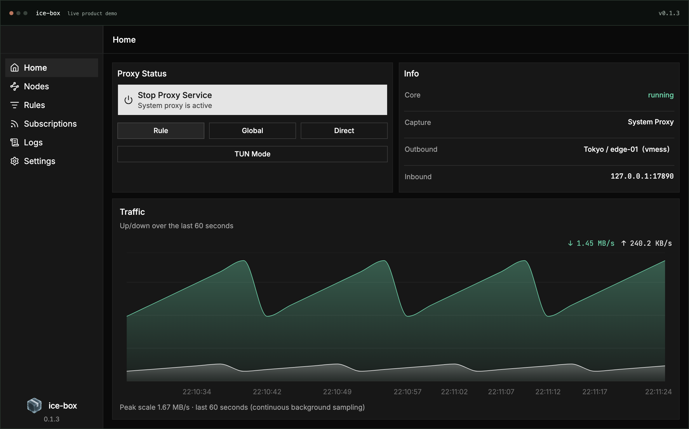

# ice-box

Lightweight proxy client for **macOS** and **Windows**.  
Tauri 2 + React, with a bundled [sing-box](https://github.com/SagerNet/sing-box) **1.13.19** core.

[Live Demo](https://yilong-musk.github.io/ice-box/)

[](https://yilong-musk.github.io/ice-box/)

## Features

- System proxy or TUN — the switch picks the **next** start, it does not hot-swap
- Subscriptions: sing-box JSON, Clash, share-link lists; **one active** at a time
- Rule / Global / Direct, node switch, latency test
- Rule search, filter, custom rules
- Live traffic on the home page

## Docs

- [Architecture](docs/architecture.md) — implementation spec
- [TUN](docs/tun.md) — capture, elevation, Windows limits
- [Release](docs/release-process.md)

## Develop

Rust (stable), Node.js 22, Xcode CLT on macOS.

```
apps/desktop    UI + Tauri shell
crates/         Rust workspace
docs/
```

```bash
cd apps/desktop && npm install && cd ../..
npm run fetch-singbox
npm run dev
```

| Command | Purpose |
|---|---|
| `npm run dev:mac-arm64` / `dev:mac-x64` / `dev:win` | Pin the host |
| `npm run gate` | fmt, clippy, tests, tsc, vitest |
| `npm run acceptance` / `acceptance:tun` / `acceptance:win` | Live host gates |

## Build

```bash
npm run fetch-singbox && npm run build              # macOS .dmg
npm run fetch-singbox -- win && npm run build:win   # Windows NSIS
```

macOS artifacts are **unsigned**. First launch: right-click → Open (or `xattr -dr com.apple.quarantine`).

## TUN

Settings/Home TUN is the desired backend for the next start. Stopping the service tears down whichever capture is active.

**macOS** — first use installs a privileged helper via the system authorization dialog.

**Windows** — one UAC creates the `ice-box-tun` scheduled task. Capture is **IPv4 TCP only**:

| Works | Does not work |
|---|---|
| IPv4 HTTPS | UDP / QUIC / HTTP3 |
| System DNS (DoT/DoH) | IPv6 |
| Mixed inbound (diagnostics) | fake-ip DNS |

Need UDP or IPv6 on Windows → use system proxy. Shape and limits: [docs/tun.md](docs/tun.md).

## License

[MIT](LICENSE). Bundled sing-box remains [GPL-3.0-or-later](third_party/sing-box/LICENSE) (upstream naming restriction). See [NOTICE](NOTICE).
