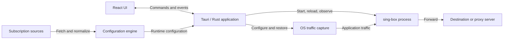

# ice-box Architecture

ice-box is a local desktop proxy client for macOS and Windows. A Tauri + React
application manages a bundled sing-box process; sing-box owns protocol handling
and traffic forwarding. This document describes the system's structure,
ownership boundaries, and key design decisions.

## System structure

The Rust application is the control plane: it owns user intent, configuration,
process lifecycle, and OS integration. sing-box is the data plane: user traffic
does not pass through React or the application's configuration code. Keeping
the core in a separate process isolates its lifecycle and avoids duplicating
protocol implementations in the client.

The desktop app manages one core instance, including when a privileged runner
starts it. The website reuses the UI with a simulated backend; it has no access
to native proxy controls.

## Responsibilities

| Component | Responsibility |
|-----------|----------------|
| [React UI](../apps/desktop/src) | Views, user commands, and shared runtime status from IPC events with polling fallback |
| [Tauri application](../apps/desktop/src-tauri/src) | IPC, tray, background workers, updates, and orchestration across core and capture |
| [ice-engine](../crates/ice-engine/src/lib.rs) | Public entry point for subscription normalization and runtime config generation |
| [ice-subscription](../crates/ice-subscription/src/lib.rs) | Fetching, parsing, caching, and managing subscription profiles |
| [ice-config](../crates/ice-config/src/lib.rs) | Local settings, rule overrides, configuration composition, and validation |
| [ice-core](../crates/ice-core/src/lib.rs) | Core process lifecycle, reload, health checks, and Clash API access |
| [ice-proxy-sys](../crates/ice-proxy-sys/src/lib.rs) | Platform system-proxy changes, backup, and restoration |
| [TUN components](tun.md) | Capture, privileged execution, resource ownership, and recovery |
| [ice-types](../crates/ice-types/src/lib.rs) | Shared settings, IPC types, errors, paths, and the core compatibility version |

Dependencies point from the application toward reusable libraries. The
configuration engine combines subscription and config logic without depending
on desktop process or OS capture backends. Core and capture libraries do not
invoke each other; the application coordinates them. Shared types prevent
low-level modules from depending on a higher-level subsystem just to exchange
data.

## Configuration flow

A subscription is fetched and normalized into a profile containing nodes,
groups, routing, and DNS. One subscription is active at a time. The engine
combines that profile with local settings, selections, rule overrides, and
capture intent to produce the runtime configuration. Without a usable profile,
the application can generate a direct-only configuration.

Raw subscriptions, normalized profiles, local preferences, and generated
runtime configuration remain separate. This preserves provider input and user
intent across regeneration. Persistent writes use atomic replacement, with
backups or journals where rollback and recovery require them.

Provider-reported usage and expiry ride along with the subscription metadata
rather than the profile, in both shapes providers use: the `subscription-userinfo`
counters (used / quota / expiry) and the info entries panels embed in the proxy
list (`Traffic: 11.84 GB | 150 GB`, `剩余流量：1023.64 GB`). Both are stored with
the subscription, so quota is visible without opening the node list. Embedded
entries are matched by label and kept verbatim as provider input; the UI parses
their amounts and dates (and falls back to the header counters for values an
entry leaves out) into one usage / expiry readout, because each panel words and
scales its own entries differently. A fetch that omits the header keeps the last
reported counters, and a conditional refresh may update them without replacing
the cached body.

The generated configuration targets the bundled core's compatibility version.
The client owns configuration generation; sing-box never fetches subscriptions
or interprets application preferences.

## Runtime ownership

Core availability and traffic capture are separate states. A running core can
serve its local Mixed inbound while OS capture is disabled. The runtime capture
controller owns the active backend; persisted settings represent user intent
and do not establish which backend currently owns OS resources. Capture
selection is also independent of Rule / Global / Direct routing policy.

Start, stop, config apply, and recovery are serialized by the application's
orchestration lock. Background workers perform blocking operations while the UI
reads runtime snapshots and receives events. This prevents overlapping
operations from racing to replace the core or restore the same OS state.

Configuration changes are validated before application. Reload is preferred
where supported, with restart as a fallback; health checks determine success.
Failures attempt to restore the previous configuration and release capture
when service cannot be recovered. OS proxy settings are backed up before
mutation and restored on stop or failure.

Startup reconciles leftover processes and capture state before starting the
core. Recovery itself does not enable capture; restoring the user's saved
service choice is a separate action. A login-item launch (`--autostart`) is a
startup with the window suppressed: `tauri.conf.json` creates the window
hidden, the shell shows it only for a user launch, and a login start that finds
the data-dir lock already held exits without raising the running session. The
login item itself is a per-user OS entry — a LaunchAgent plist on macOS,
`HKCU\...\Run` on Windows — owned by the shell (`autostart.rs`), rewritten to
the running executable on every launch, and recorded in
`settings.json` (`launch_at_login`) only after the OS write succeeded. The
Settings card is rendered only where the platform can register the entry
(`launch_at_login_supported` in the status snapshot), and a macOS instance
running from the read-only App Translocation mount is refused before anything
is written.
Closing the window leaves the app in the tray, whose menu mirrors the Home
power switch (start / stop the proxy service)
and the routing-mode selector, the Subscriptions page for switching the active
subscription, and the Nodes page for switching the active exit (one node per
strategy group, nested one level down); all of them call the same command paths
the window does. On macOS the icon also carries a live traffic readout next to
it, re-derived once a second from the same `/traffic` stream the Home chart
reads. The readout is drawn in a tabular-figure font inside one cell measured
from the widest unit, with the number right-aligned by figure spaces rather than
a leading zero, so the item keeps one width whether the rate is `0.0` or
`99.9 M/s`; a detached stream or a stale tick reads `0.0 B/s` instead of
clearing the text, so the item holds its width while the proxy service starts
and stops, and the text dims while that service is off — the power control's
state, which the same posture answers, not the core process, which can run on
its own — so those zeroes read as idle rather than as live traffic. The two
stacked lines are set as one image together with the icon (`tray_speed.rs`),
because a status item centres an image but pins a title to the top of the item
— two lines of the menu-bar font would not fit the bar either. The Settings
page picks what the item shows — icon + readout, icon only, or readout only —
through `tray_display_mode`, which the same watchdog reads once a second;
readout-only
always has that text to draw, which is what keeps the item clickable. On
Windows those menus are classic Win32 popup menus, which ignore the mouse wheel:
`tray_wheel.rs` hooks the tray thread and turns wheel messages into the arrow
keys a long menu (the node list of a large subscription) already scrolls with.
Quitting releases capture before stopping the core. TUN state transitions and
recovery rules are maintained only in [tun.md](tun.md).

## Trust boundaries

React issues typed Tauri commands; Rust owns subscription networking, filesystem
access, core control, and privileged operations. IPC errors use shared stable
codes with localized UI messages, keeping presentation separate from failure
classification.

Subscriptions are untrusted input. Fetching applies address and redirect
restrictions, TLS validation, and size limits; parsing and configuration
generation constrain what reaches the core. Subscription fetches use direct
connections so refreshing a broken profile does not depend on that profile.

The Clash control API stays on loopback and requires a per-install `secret`
(`Authorization: Bearer`). Privileged runners authenticate callers
and validate executable/configuration inputs before execution; the shared
[config guard](../crates/ice-config-guard/src/lib.rs) restricts elevated configs
(including DNS server types: filesystem `hosts.path` is not a DoH URL path;
mixed inbound listen/port; `urltest` health-check URLs; `experimental` keys
other than `clash_api` / `cache_file`). User-mode generation drops remote
`rule_set` URLs and disallowed DNS types so the unelevated core has the same
fetch/file surface.
Platform privilege and ownership rules live in [tun.md](tun.md).

The Home card and the tray also expose session-only terminal helpers: they set
the Mixed env for one new process and never touch shell profiles or user
environment. Rust owns both the command text and the clipboard, so a copied
command cannot drift from the env a terminal opened by the app receives; the
one-liner follows the login shell (POSIX `export`, fish `set -gx`) and the
Terminal.app launch passes the vars through `env` and resolves the login shell
in `/bin/sh -c`, so the typed line stays within syntax every login shell accepts
(a fish or csh window cannot abort it) and needs no shell-specific form.
Its do-script line wipes screen and saved lines (`2J`/`3J`, the latter ignored
where unsupported) before it replaces the shell: Terminal types that line into
a shell it has already started, so the login banner and the echoed command
would otherwise stay in the new window.
`mixed_listen` is unvalidated while Allow LAN is on, so the resolved host is
allow-listed (hostname / IPv4 / bracketed IPv6 characters) before it is
embedded in a generated `export` / `set` / AppleScript string, and a denied
macOS Automation consent surfaces as an IPC error instead of a silent no-op.
Both helpers stay available while the proxy service is stopped — the port falls
back to the saved settings so a command can be prepared before starting it —
and they never read or write the user's environment outside the process they
start.

App updates run in Rust and verify signed artifacts before installation.
Installation uses the same capture/core shutdown path as Quit. Update integrity
signing is separate from OS application signing; artifact production and
distribution policy are defined in [release-process.md](release-process.md).
Every launch runs one background check round after the first UI frame. That
launch round ignores the 24-hour cooldown, so restarting always reaches GitHub.
A successful GitHub fetch starts the cooldown in `update-check.json`, which
paces the rounds that follow while the app keeps running. A failure is logged
and retried silently with exponential backoff (sooner if the core becomes
Running) through one 15-minute attempt; that last failure records
`last_check_at` and starts the same cooldown. Retries inside a round, from the
launch or an in-session round, do not write the cooldown.
A newer version is surfaced in two places the window keeps in step: the sidebar
arrow beside the version label and a tray menu prompt carrying the same green
arrow (`set_tray_update_available`). Both point at Settings → App Updates, and
turning automatic checks off clears both.

## Further reading

- [README](../README.md): installation, usage, and local development.
- [TUN](tun.md): capture behavior, platform configuration, privileges, and limits.
- [Testing](testing.md): local/CI coverage and manual acceptance tests.
- [Release process](release-process.md): versioning, signing, packaging, and publication.

Field schemas, command signatures, and implementation details are maintained
with their owning source modules.
