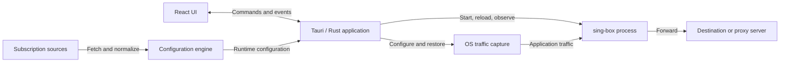

# ice-box Architecture

ice-box is a local desktop proxy client for macOS and Windows. A Tauri + React
application manages a bundled sing-box process; sing-box owns protocol handling
and traffic forwarding. This document describes the system's structure,
ownership boundaries, and key design decisions.

## System structure

The Rust application is the control plane: it owns user intent, configuration,
process lifecycle, and OS integration. sing-box is the data plane: user traffic
does not pass through React or the application's configuration code. Keeping
the core in a separate process isolates its lifecycle and avoids duplicating
protocol implementations in the client.

The desktop app manages one core instance, including when a privileged runner
starts it. The website reuses the UI with a simulated backend; it has no access
to native proxy controls.

## Responsibilities

| Component | Responsibility |
|-----------|----------------|
| [React UI](../apps/desktop/src) | Views, user commands, and shared runtime status from IPC events with polling fallback |
| [Tauri application](../apps/desktop/src-tauri/src) | IPC, tray, background workers, updates, and orchestration across core and capture |
| [ice-engine](../crates/ice-engine/src/lib.rs) | Public entry point for subscription normalization and runtime config generation |
| [ice-subscription](../crates/ice-subscription/src/lib.rs) | Fetching, parsing, caching, and managing subscription profiles |
| [ice-config](../crates/ice-config/src/lib.rs) | Local settings, rule overrides, configuration composition, and validation |
| [ice-core](../crates/ice-core/src/lib.rs) | Core process lifecycle, reload, health checks, and Clash API access |
| [ice-proxy-sys](../crates/ice-proxy-sys/src/lib.rs) | Platform system-proxy changes, backup, and restoration |
| [TUN components](tun.md) | Capture, privileged execution, resource ownership, and recovery |
| [ice-types](../crates/ice-types/src/lib.rs) | Shared settings, IPC types, errors, paths, and the core compatibility version |

Dependencies point from the application toward reusable libraries. The
configuration engine combines subscription and config logic without depending
on desktop process or OS capture backends. Core and capture libraries do not
invoke each other; the application coordinates them. Shared types prevent
low-level modules from depending on a higher-level subsystem just to exchange
data.

## Configuration flow

A subscription is fetched and normalized into a profile containing nodes,
groups, routing, and DNS. One subscription is active at a time. The engine
combines that profile with local settings, selections, rule overrides, and
capture intent to produce the runtime configuration. Without a usable profile,
the application can generate a direct-only configuration.

Raw subscriptions, normalized profiles, local preferences, and generated
runtime configuration remain separate. This preserves provider input and user
intent across regeneration. Persistent writes use atomic replacement, with
backups or journals where rollback and recovery require them.

The generated configuration targets the bundled core's compatibility version.
The client owns configuration generation; sing-box never fetches subscriptions
or interprets application preferences.

## Runtime ownership

Core availability and traffic capture are separate states. A running core can
serve its local Mixed inbound while OS capture is disabled. The runtime capture
controller owns the active backend; persisted settings represent user intent
and do not establish which backend currently owns OS resources. Capture
selection is also independent of Rule / Global / Direct routing policy.

Start, stop, config apply, and recovery are serialized by the application's
orchestration lock. Background workers perform blocking operations while the UI
reads runtime snapshots and receives events. This prevents overlapping
operations from racing to replace the core or restore the same OS state.

Configuration changes are validated before application. Reload is preferred
where supported, with restart as a fallback; health checks determine success.
Failures attempt to restore the previous configuration and release capture
when service cannot be recovered. OS proxy settings are backed up before
mutation and restored on stop or failure.

Startup reconciles leftover processes and capture state before starting the
core. Recovery itself does not enable capture; restoring the user's saved
service choice is a separate action. Closing the window leaves the app in the
tray, whose menu mirrors the Home power switch (start / stop the proxy service)
and the routing-mode selector, the Subscriptions page for switching the active
subscription, and the Nodes page for switching the active exit (one node per
strategy group, nested one level down); all of them call the same command paths
the window does.
Quitting releases capture before stopping the core. TUN state transitions and
recovery rules are maintained only in [tun.md](tun.md).

## Trust boundaries

React issues typed Tauri commands; Rust owns subscription networking, filesystem
access, core control, and privileged operations. IPC errors use shared stable
codes with localized UI messages, keeping presentation separate from failure
classification.

Subscriptions are untrusted input. Fetching applies address and redirect
restrictions, TLS validation, and size limits; parsing and configuration
generation constrain what reaches the core. Subscription fetches use direct
connections so refreshing a broken profile does not depend on that profile.

The Clash control API stays on loopback and requires a per-install `secret`
(`Authorization: Bearer`). Privileged runners authenticate callers
and validate executable/configuration inputs before execution; the shared
[config guard](../crates/ice-config-guard/src/lib.rs) restricts elevated configs
(including DNS server types: filesystem `hosts.path` is not a DoH URL path;
mixed inbound listen/port; `urltest` health-check URLs; `experimental` keys
other than `clash_api` / `cache_file`). User-mode generation drops remote
`rule_set` URLs and disallowed DNS types so the unelevated core has the same
fetch/file surface.
Platform privilege and ownership rules live in [tun.md](tun.md).

App updates run in Rust and verify signed artifacts before installation.
Installation uses the same capture/core shutdown path as Quit. Update integrity
signing is separate from OS application signing; artifact production and
distribution policy are defined in [release-process.md](release-process.md).

## Further reading

- [README](../README.md): installation, usage, and local development.
- [TUN](tun.md): capture behavior, platform configuration, privileges, and limits.
- [Testing](testing.md): local/CI coverage and manual acceptance tests.
- [Release process](release-process.md): versioning, signing, packaging, and publication.

Field schemas, command signatures, and implementation details are maintained
with their owning source modules.
