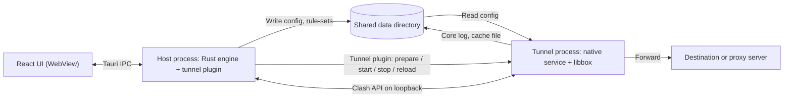

# Mobile Client Design

Status: **in progress**. Phase 0 (Android spike) and Phase 1 (shared groundwork)
are implemented. Phase 2 (Android MVP) is underway: the phone layout, the
`apps/mobile` composition root, the Tauri Android project
(`com.yilongmusk.icebox`, minSdk 34, arm64-v8a plus emulator x86_64), the
`tunnel` plugin, and the host commands that write subscriptions and
`config.json` exist. A signed APK does not yet. iOS is deferred; the shared
architecture is designed so an iOS client
plugs into it later without reworking the Android client (see
[iOS (deferred)](#ios-deferred)).

Decisions already taken:

| Topic | Decision |
|-------|----------|
| Shell | Tauri 2 mobile (system WebView + Rust), reusing the React UI and the Rust engine |
| Core | sing-box embedded as libbox (gomobile), running in a separate tunnel process |
| Capture | The platform VPN API: `VpnService` on Android, a Packet Tunnel extension on iOS |
| Platform order | Android first; iOS deferred until an Apple Developer Program membership is available |
| Android distribution | Signed APKs on GitHub Releases; no Google Play listing for now |
| Android minimum | Android 14 (API 34), for both `minSdk` and the tested floor |

## Goals and non-goals

The first Android release matches the desktop client's daily workflow on a
phone:

- import, refresh, activate, and remove subscriptions (same formats and usage /
  expiry readout as desktop);
- Rule / Global / Direct routing and per-group node selection with delay tests;
- start and stop the VPN, with live traffic and connection state on Home;
- the Rules view (disable subscription rules, add custom rules);
- logs and the subset of Settings that applies to a phone.

Out of scope for the first release: Google Play, tablet layout, per-app
routing, Quick Settings tile, speed in the notification, LAN sharing, in-app
APK installation, and background subscription refresh beyond best effort. The
design leaves room for each of them.

## Shared architecture

### Process model

Neither mobile OS fits the desktop model of a Rust control plane spawning a
`sing-box` process: iOS forbids spawning, and Android only keeps a VPN alive
inside a `VpnService`. Both platforms use the same two-process split:



| Process | Android | iOS | Owns |
|---------|---------|-----|------|
| Host | App process (`MainActivity`) | App process | UI, subscriptions, settings, rule overrides, config generation, Clash API client |
| Tunnel | `:tunnel` process running the `VpnService` | Packet Tunnel extension | libbox lifecycle, the TUN descriptor, platform network settings |

The tunnel process contains only native code (Kotlin or Swift) and libbox; it
loads no Rust and no WebView. On iOS this is forced by the extension's memory
limit. On Android it keeps the VPN independent of the UI process (which the OS
may destroy while the VPN runs) and keeps both platforms on one design. The
consequence is that the tunnel runs only the last configuration the host
wrote: a VPN started by the system (Android always-on VPN, the iOS Settings
switch) uses that file, and a missing or invalid file stops the tunnel with an
error instead of generating a fallback.

### Tunnel plugin contract

One Tauri plugin, `tunnel`, has the same command surface on both platforms: a
Kotlin implementation now and a Swift implementation later. The Rust side of
the app only sees this contract.

| Command / event | Meaning | Android | iOS |
|-----------------|---------|---------|-----|
| `prepare` | Obtain VPN permission | `VpnService.prepare` consent dialog | Install the VPN profile (system prompt) |
| `start` / `stop` | Start or stop the tunnel | Start the foreground service / stop it | `NETunnelProviderManager` start / stop |
| `reload` | Re-read the config; returns ok or a stable error code | Bound-service message | `sendProviderMessage` |
| `status` / `status-changed` | Permission, connecting, connected, disconnecting, stopped, error | Service broadcast | `NEVPNStatus` observation |
| `shared_dir` | Root of the shared data directory | App `filesDir` (shared by both processes) | App Group container |
| `memory` | Tunnel process memory for the Home row | Service message | Provider message |

Nodes, routing mode, delay tests, `/traffic`, and `/version` health go over the
Clash API on `127.0.0.1` with the per-install secret, so the Clash client,
traffic monitor, and health probe in `ice-core` are reused unchanged. On
Android, loopback between processes of one app works without extra setup; on
iOS it is the first item the iOS spike verifies, with the libbox command server
on a Unix socket in the App Group as the fallback.

### Rust workspace reuse

| Crate | Mobile | Change |
|-------|--------|--------|
| `ice-types` | Reused | `AppPaths` separates a shared root (files the tunnel reads) from the host-private root; on Android both may be `filesDir` |
| `ice-config` | Reused | Mobile TUN and DNS shapes; `tun_ready()` and `tun_gate_for` cover `Android` and `Ios` |
| `ice-config-guard` | Reused | Only its user-mode filtering (remote `rule_set` URLs, DNS types); no elevated path |
| `ice-subscription` | Reused | `rustls-platform-verifier` needs Android initialization (see [Android](#android)) |
| `ice-engine` | Reused | `host_platform()` already maps `android` and `ios` |
| `ice-core` | Partly | Clash API, traffic, and health reused; process, pid, signal reload, and binary lookup are not built |
| `ice-proxy-sys`, `ice-tun-*`, `ice-helper`, `ice-elevate` | Not built | Desktop capture and privilege only |

### Mobile configuration shape

`build_runtime_config` gains a mobile branch selected by `HostPlatform::Android`
and `HostPlatform::Ios`, with per-platform differences kept small. Its unit
tests run on every host and need no mobile toolchain:

- Capture is always TUN. There is no system-proxy backend and no
  `CaptureIntent::Diagnostic` start; `TunSettings.enabled` is ignored.
- The `tun` inbound omits `interface_name`. libbox passes the TUN options to
  the platform interface, which applies them (`VpnService.Builder` or
  `NEPacketTunnelNetworkSettings`); `auto_route` describes routes for the
  platform to install, not a route table the core edits.
- IPv4 and IPv6 addresses remain mandatory, as on desktop ([tun.md](tun.md)).
- DNS uses `hijack-dns`, and the platform points the tunnel's DNS server at the
  TUN address so system resolution enters sing-box.
- Reserved rules keep loopback and the Clash API direct; macOS-specific and
  Windows-specific reserved ranges are not emitted.
- The Mixed inbound is omitted (no LAN sharing, no terminal helpers).
- `rule_set` and `cache_file` paths point into the shared root.
- Android only: the app's own package is excluded from the tunnel, so
  subscription fetches stay direct as on desktop and the core's outbound
  sockets cannot loop back into the tunnel.

Per-app routing later maps onto sing-box `include_package` / `exclude_package`
on Android; iOS has no equivalent for packet tunnels.

### Headless application crate

`src-tauri/src/application` already keeps use cases free of Tauri imports, but
`AppState` still mixes shared state with desktop-only resources (system proxy,
capture controller, instance lock, tray). The first phase extracts the shared
part into a new `crates/ice-app` crate:

- subscriptions, settings, node and rule selection, profile caches, the runtime
  read model, and log reads move into `ice-app`;
- core lifecycle is reached through a trait (prepare, start, stop, reload,
  state) with two implementations: the existing `CoreController` process
  backend on desktop and a tunnel-plugin backend shared by Android and iOS;
- capture (`CaptureController`, system proxy, TUN recovery journal) stays in
  the desktop shell. On mobile the OS tears the tunnel down when the tunnel
  process exits, so there is nothing to recover.

The desktop shell keeps its behavior and tests. The architecture regression
tests are extended so `ice-app` never depends on Tauri or the desktop capture
crates.

### Mobile shell layout

A separate Tauri app at `apps/mobile` avoids spreading `cfg(mobile)` through the
desktop shell's tray, updater, autostart, and capture code. The iOS entries are
created only when iOS resumes:

```
apps/mobile/
  src/                    composition root: binds @platform/api and @platform/windowChrome
  src-tauri/
    src/                  Tauri commands over ice-app, tunnel-plugin core backend
    gen/android/          Gradle project generated by `tauri android init`, committed
      .../tunnel/         VpnService and libbox platform interface (Kotlin)
    gen/apple/            (iOS, later) Xcode project and Packet Tunnel extension
  plugins/tunnel/
    android/              Kotlin plugin implementation
    ios/                  (iOS, later) Swift plugin implementation
```

The generated native projects are committed after the tunnel service,
manifest entries, and signing configuration are added, so regenerating them
does not drop that work. libbox artifacts are built by scripts and not
committed.

### Behavior mapping

| Desktop behavior | Android | iOS (later) |
|------------------|---------|-------------|
| Home power switch | `prepare` on first use, then start the VPN | Same; first use installs the VPN profile |
| System proxy / TUN switch | None; the VPN is the only capture | Same |
| Config apply while running | Write config, `reload`; restart the tunnel on failure | Same |
| TUN journal and startup recovery | None | None |
| `WorkerSupervisor` workers | Foreground timers; refresh on app resume, `WorkManager` later | Foreground timers; `BGAppRefreshTask` later |
| Launch at login | System always-on VPN setting | Connect On Demand (later) |
| Tray | Persistent VPN notification; Quick Settings tile later | Control Center / widget later |
| Terminal helpers, reveal data dir | None | None |
| In-app updates | Check GitHub Releases and open the APK download | TestFlight |

## Android

### VPN service

- The `VpnService` runs in a `:tunnel` process declared in the manifest with
  `BIND_VPN_SERVICE`, as a foreground service with a persistent notification.
  With the API 34 floor, the `POST_NOTIFICATIONS` runtime permission and a
  declared foreground service type are always required, with no fallback path
  for older releases (`systemExempted` covers apps configured as VPNs;
  `specialUse` is the alternative), confirmed in the spike.
- The Kotlin service implements the libbox platform interface: open the TUN
  through `VpnService.Builder` (addresses, routes, DNS, MTU, own-package
  exclusion), `protect()` core sockets, default-network monitoring through
  `ConnectivityManager` for reconnects, and a log sink into the shared root.
- The service declares always-on VPN support, so the system can start it
  without the UI; it then reads the last config as described above.

### libbox

The desktop build downloads a pinned `sing-box` binary
([`third_party/sing-box`](../third_party/sing-box)). Android embeds the core as
a libbox AAR built from the same pinned source tag:

- `scripts/build-libbox.sh android` runs that tag's `cmd/internal/build_libbox`,
  so the JDK check, NDK pin, API level, ldflags, and tag list come from the
  release being built. The script keeps the primary `libbox.aar` and, when
  that release still has one, skips the legacy AAR. It keeps the feature tags
  config generation emits (`gvisor`, `quic`, `wireguard`, `utls`, `clash_api`)
  plus whatever toolchain tags upstream added, and drops other `with_*` tags
  (Naive, Tailscale, and protocols a newer release may add). Extend that
  allowlist when config generation starts emitting one of those protocols.
  The AAR checksum is recorded next to the existing ones. The same script
  gains an `apple` target when iOS resumes.
- The cloned tag is `third_party/sing-box/VERSION`. `build_libbox` embeds
  `git describe` of that checkout, which the script requires to be exactly
  that version, the same string as `ENGINE_COMPAT_CORE_VERSION`.

### Rust on Android

- Targets: `aarch64-linux-android` (`arm64-v8a`) for devices and
  `x86_64-linux-android` for the emulator and CI only. 32-bit ABIs are not
  built: Android 14 phones are effectively all 64-bit ARM.
- `rustls-platform-verifier` requires a one-time JNI initialization with the
  Android context and its bundled Kotlin component in the Gradle build;
  without it every subscription HTTPS fetch fails certificate verification.
- Logs go through `tracing` to a file in the host-private root, which the
  Logs view merges with the core log from the shared root, as on desktop.

### Distribution and updates

- APKs are signed with a project release keystore; the keystore and its
  passwords live in CI secrets and never in the repository. Losing the key
  means users must uninstall to upgrade, so it is backed up offline.
- Releases attach one `arm64-v8a` APK next to the desktop installers; the
  `x86_64` build is a development artifact and is not published. The Tauri
  updater plugin does not support Android; the app checks GitHub Releases the
  way desktop does and opens the APK download for the system installer.
- The Android version code is derived from the semantic version, so every
  release installs over the previous one.

## Frontend

`apps/mobile` is a third composition root next to desktop and the Live Demo,
aliasing `@` to `apps/desktop/src` the way the website does:

- `@platform/api` binds a mobile Tauri adapter; `@platform/windowChrome` binds
  a no-op chrome (no traffic lights or caption buttons).
- `ApiContract` splits into a shared core contract and capability groups
  (desktop capture and elevation, tray, terminal helpers, app update, data
  directory). Views check capability flags in the status snapshot, following
  the existing `launch_at_login_supported` pattern, rather than the user agent;
  `detectWindowChrome` currently classifies an iPhone as `macos-overlay`.
- The status snapshot gains the VPN permission state (not granted, granted) and
  the tunnel status from the plugin, so Home can explain the first-run consent.
- The layout gains a phone variant used by both platforms: bottom tab
  navigation instead of the sidebar, safe-area insets, touch-sized targets, and
  a Home without the system-proxy, TUN, and Mixed cards.

## Build, CI, and release

- Android builds run on Linux with JDK 17, the Android SDK and NDK, Go, and
  gomobile; the current development environment and the existing Ubuntu CI
  runners can build them. Device testing uses a physical phone over `adb`.
- `rust-toolchain.toml` adds the Android targets.
- CI gains an Android job: `cargo check` for the Android targets, the libbox
  build (cached by version), and an unsigned debug APK. Signed release APKs
  are built only in the release workflow.
- `scripts/gate-local.sh` runs the mobile config tests on every host; the
  Android build step runs only where the SDK is installed.
- `scripts/bump-version.sh` also sets the Android version name and code.
- `docs/release-process.md` gains an Android section once the first APK
  ships; desktop releases are unchanged.

## iOS (deferred)

iOS reuses everything above: the process model, the tunnel plugin contract,
the mobile config branch, `ice-app`, and the phone layout. Resuming it adds:

- **Account.** A paid Apple Developer Program membership. The Packet Tunnel
  entitlement is not available to a free personal team, and TestFlight
  requires App Store Connect.
- **Native parts.** A Packet Tunnel extension (Swift + `Libbox.xcframework`),
  the Swift plugin implementation, an App Group for the shared root, and the
  extension target in `gen/apple`'s XcodeGen `project.yml`.
- **Constraints.** The extension memory limit (about 50 MB) must be measured
  with a large real subscription; libbox needs the tunnel descriptor, which
  `NEPacketTunnelFlow` does not expose publicly, so the approach proven by
  the upstream sing-box Apple client is used; host traffic, including
  subscription fetches, goes through the tunnel while it is up, because iOS
  cannot exclude the host app.
- **Build and distribution.** macOS CI with Xcode, a Rust iOS target check, and
  TestFlight builds signed with an App Store Connect API key.

Items that Android work must not break for iOS:

- no Kotlin-only concept leaks into the plugin contract or `ice-app` (for
  example, Android intents or package names stay inside the Kotlin plugin);
- the shared root stays a separate path in `AppPaths` even where Android maps
  it to the same directory;
- the mobile config branch keeps its Android-only rules behind
  `HostPlatform::Android`.

## Phases

| Phase | Scope | Exit criteria |
|-------|-------|---------------|
| 0. Android spike | Minimal `VpnService` app with the libbox AAR 1.13.19 in a `:tunnel` process, running a config from `ice-engine` for `Android` | IPv4 and IPv6 traffic through the tunnel; the host process reaches the Clash API; subscription HTTPS fetch works on device; always-on start works |
| 1. Shared groundwork | Mobile config shape and tests, `ice-app` extraction, `ApiContract` split | Desktop behavior unchanged; `scripts/gate-local.sh` passes |
| 2. Android MVP | `apps/mobile`, tunnel plugin (Kotlin), VPN service, phone layout | Goals above work on device; signed APK attached to a pre-release |
| 3. Follow-up | Background refresh, Quick Settings tile, per-app routing, notification speed | Tracked separately |
| 4. iOS | See [iOS (deferred)](#ios-deferred) | Internal TestFlight build |

Phase 0 is a go/no-go point: if the two-process split or the loopback Clash API
does not hold on Android, the design changes before Phase 1 starts.

### Phase 0 results

Run on an Android 14 emulator (API 34, `x86_64`), with libbox 1.13.19 and a
config from `ice-engine` for `HostPlatform::Android`. The spike lives in
`spikes/android-vpn/` and is not part of the product. The two-process split
and the loopback Clash API both held, so Phase 1 can keep this design.

| Check | Result |
|-------|--------|
| Two processes | Host and `:tunnel` run as separate pids; the tunnel process loads no Rust |
| IPv4 through the tunnel | ICMP to `223.5.5.5` and a TCP connection were forwarded by the `direct` outbound, sourced from `172.19.0.1` |
| IPv6 through the tunnel | An ICMP packet from `fdfe:dcba:9876::1` entered the tunnel and was forwarded. The emulator has no IPv6 upstream, so there was no reply |
| Clash API from the host | `mode=Rule`, groups `GLOBAL=proxy` and `proxy=server1`. A delay test reached the core and came back `504` (the test node does not answer) |
| Subscription HTTPS | `rustls-platform-verifier` initialized, and a direct HTTPS GET returned a body. A private-IP subscription URL was rejected by the existing fetch guard. A real URI-list body produced a 17-outbound config on device |
| Always-on | After reboot the system started the tunnel with `android.net.VpnService`, without the UI process, and it loaded the last config |
| Tunnel memory | About 61 MB PSS for a small config. Android has no extension-sized cap; this is not the iOS 50 MB limit |

Findings that Phase 1 has to absorb:

- sing-box 1.13.19 no longer accepts a WireGuard **outbound** with
  `local_address`. The field is unknown, and one such node rejects the whole
  config. 1.13 models WireGuard as an endpoint (`address`, `peers`). The
  subscription parser still stores the old outbound shape so cached profiles
  stay valid; config generation rewrites those nodes into endpoints.
- A body that is not a subscription (an HTML page) used to panic the engine.
  Markup is now an unknown-format error, and a parser panic becomes a
  subscription error.
- `ice-core` did not compile for Android until `si_pid` was treated as a
  method on Android the way it already is on Linux.
- Android application ids cannot contain `-`. The desktop id
  `com.yilong-musk.icebox` is not a legal Android application id. The spike
  uses `com.yilongmusk.icebox.spike`. The product id is
  `com.yilongmusk.icebox`, the desktop id with the hyphen removed.
- An `arm64-v8a` libbox is about 39 MB uncompressed (about 13 MB deflated).
  The release APK that also carries `x86_64` is about 94 MB only because the
  spike ships both ABIs.

## Risks

| Risk | Impact | Mitigation |
|------|--------|------------|
| OEM background restrictions | The VPN is killed on some vendor ROMs | Foreground service, a battery-optimization exemption prompt, always-on VPN guidance |
| Private DNS (DNS over TLS) in strict mode | System DNS bypasses `hijack-dns` | Detect it and explain in the UI; cover it in the spike |
| Tauri mobile maturity and native project edits | Build friction on Tauri upgrades | Commit generated projects; pin Tauri versions; CI APK build |
| libbox build toolchain (Go, gomobile fork) | Unreproducible or broken core builds | Pin toolchain versions in the script; cache per core version; checksum artifacts |
| Release keystore loss | Users cannot upgrade in place | Offline backup; key only in CI secrets |
| iOS constraints discovered late | Shared contract needs rework | Keep the iOS checklist above in reviews of Phase 1 and Phase 2 |

## Open questions

- Whether to target F-Droid later, which suits the GPL but builds from source,
  including the Go toolchain.
- For iOS: minimum version, bundle ID, the Apple Developer team, and the GPL
  position on Apple distribution.
